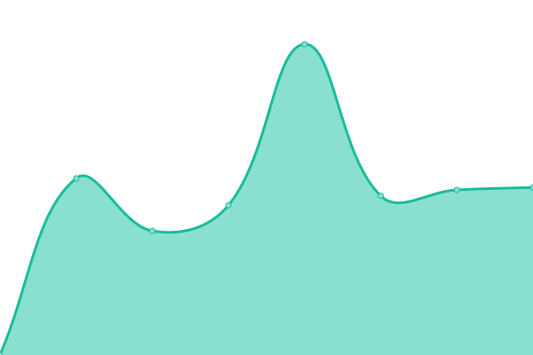

# [📈 Live Status](https://status.nthusa.tw): <!--live status--> **🟩 All systems operational**

This repository contains the open-source uptime monitor and status page for [Upptime](https://upptime.js.org), powered by [Upptime](https://github.com/upptime/upptime).

With [Upptime](https://upptime.js.org), you can get your own unlimited and free uptime monitor and status page, powered entirely by a GitHub repository. We use [Issues](https://github.com/upptime/upptime/issues) as incident reports, [Actions](https://github.com/NTHU-SA/upptime/actions) as uptime monitors, and [Pages](https://status.nthusa.tw) for the status page.

<!--start: status pages-->
<!-- This summary is generated by Upptime (https://github.com/upptime/upptime) -->
<!-- Do not edit this manually, your changes will be overwritten -->
<!-- prettier-ignore -->
| URL | Status | History | Response Time | Uptime |
| --- | ------ | ------- | ------------- | ------ |
|  [NTHU Data API by NTHUSA](https://api.nthusa.tw) | 🟩 Up | [nthu-data-api-by-nthusa.yml](https://github.com/NTHU-SA/upptime/commits/HEAD/history/nthu-data-api-by-nthusa.yml) | 

 790ms
     
 | 

<a href="https://status.nthusa.tw/history/nthu-data-api-by-nthusa">99.93%</a>
    

|  [國立清華大學 eeclass 數位學習平台](https://eeclass.nthu.edu.tw/) | 🟩 Up | [eeclass.yml](https://github.com/NTHU-SA/upptime/commits/HEAD/history/eeclass.yml) | 

 3811ms
     
 | 

<a href="https://status.nthusa.tw/history/eeclass">100.00%</a>
    

|  [清華 eLearn 數位學習平台](https://elearn.nthu.edu.tw/) | 🟩 Up | [e-learn.yml](https://github.com/NTHU-SA/upptime/commits/HEAD/history/e-learn.yml) | 

 2557ms
     
 | 

<a href="https://status.nthusa.tw/history/e-learn">99.87%</a>
    

<!--end: status pages-->

[**Visit our status website →**](https://status.nthusa.tw)

## 📄 License

- Powered by: [Upptime](https://github.com/upptime/upptime)
- Code: [MIT](./LICENSE) © [Anand Chowdhary](https://anandchowdhary.com), supported by [Pabio](https://pabio.com)
- Data in the `./history` directory: [Open Database License](https://opendatacommons.org/licenses/odbl/1-0/)
